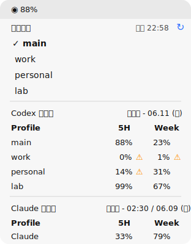

# Codex Desktop Usage Switcher

Local helper for switching Codex Desktop profiles and checking AI tool usage.
macOS uses a menu bar app; Windows uses a tray-icon app with a custom usage
popup.

## Quick Start

### Windows — one-click install on another PC

Build the distributable ZIP once on a build machine:

```powershell
.\scripts\package-windows.ps1 -SelfContained
```

Copy `dist\CodexDesktopUsageSwitcher-win-x64.zip` to the target PC, unzip,
and **double-click `install.cmd`**. It checks Python 3 (offers a winget
install), copies the app to `%LOCALAPPDATA%`, adds Start Menu and login
auto-start shortcuts, and launches the tray app. No .NET runtime needed
(self-contained build). Options: `install.cmd -NoStartup -NoLaunch`

### From source

Windows:

```powershell
git clone https://github.com/cogusrlchg-wq/codex-desktop-usage-switcher.git
cd codex-desktop-usage-switcher
.\scripts\install-local-windows.ps1
```

Open the Windows tray app:

```powershell
& "$env:LOCALAPPDATA\CodexDesktopUsageSwitcher\CodexDesktopUsageSwitcher.Windows.exe"
```

Build a distributable ZIP:

```powershell
.\scripts\package-windows.ps1 -SelfContained
```

macOS:

```bash
git clone https://github.com/cogusrlchg-wq/codex-desktop-usage-switcher.git && cd codex-desktop-usage-switcher && ./scripts/install-local.sh
```

Open the app:

```bash
open "$HOME/Applications/CodexDesktopMenu.app"
```

The Windows installer builds the app, copies it to
`%LOCALAPPDATA%\CodexDesktopUsageSwitcher`, adds a Start Menu shortcut, and
creates:

```text
%USERPROFILE%\bin\codex-desktop-switch.cmd
```

The macOS installer builds the app, copies it to `~/Applications`, and creates:

```text
~/bin/codex-desktop-switch
```

Make sure `~/bin` is in your shell `PATH`.

## Screenshot



The screenshot uses dummy profile names.

## What It Does

- Switches Codex Desktop profiles stored under `~/.codex-switch/profiles/`.
- Shows Codex 5H / Week remaining quota.
- Shows optional Claude 5H / Week remaining quota.
- On Windows, the app stays in the system tray by default. Left-click or
  right-click the tray icon to open the custom usage popup.
- On Windows, `설정` can toggle up to six taskbar notification-area number
  icons: Codex 5H / Week, CodexSub 5H / Week, and Claude 5H / Week.
- The popup shows the active Codex profile and 5H / Week remaining quota
  immediately.
- Refreshes usage in place when you click `새로고침`; the popup stays open.
- Selects a profile when you click its row; `Switch profile` or a row
  double-click asks for confirmation and switches accounts.
- On Windows, `설정` opens a settings window for adding Codex profiles, saving
  the current Codex login as a profile, launching Claude usage login, launching
  Claude Code login, running Doctor, and opening the profiles folder.

Warning rule:

- Codex and Claude are shown as remaining quota, so `20%` or less shows an
  orange warning.
- Claude remaining quota is calculated as `100 - current Claude utilization`.

## Requirements

- macOS or Windows
- Codex Desktop
- Python 3
- macOS: Xcode command line tools with `swiftc`
- Windows: no .NET runtime is needed for the packaged self-contained zip;
  .NET SDK/runtime is only needed for local builds.
- Codex CLI in `PATH`, or `CODEX_CLI_PATH`

Linux is not supported.

Windows notes:

- Requires Windows, Python 3, and .NET SDK/runtime for local builds.
- Put `codex` on `PATH` or set `CODEX_CLI_PATH`.
- If Codex.exe is installed outside common locations, set
  `CODEX_DESKTOP_APP_PATH`.

## Add a Codex Profile

```bash
codex-desktop-switch login main
codex-desktop-switch login work
codex-desktop-switch list
```

Switch from the CLI only after Codex Desktop is fully quit:

```bash
codex-desktop-switch use main
codex-desktop-switch use main --apply
```

The menu/tray app asks for confirmation, can ask Codex to quit, clean up leftover
app-server/tool-session processes, apply the switch, and open Codex again.

Optional menu order:

```json
{
  "profiles": ["main", "work", "personal"],
  "refresh_minutes": 10
}
```

Save it as `~/.codex-switch/config.json`.

## CLI

```bash
codex-desktop-switch list
codex-desktop-switch current
codex-desktop-switch usage
codex-desktop-switch use main --apply
codex-desktop-switch restore <backup-id> --apply
codex-desktop-switch stop-codex --help
```

`use` is dry-run unless `--apply` is passed.

## Claude Usage

```bash
codex-desktop-switch claude-login
codex-desktop-switch claude-usage --json
```

On Windows, the tray menu item `Claude 로그인` opens a visible terminal and runs
the interactive `claude-login` flow. Authorize in the browser, then paste only
the OAuth code into that terminal.

If OAuth returns a stale-code or rate-limit error, do not retry the same code.
Reset pending login state and start a fresh login later:

```bash
codex-desktop-switch claude-login-reset
```

## Gatekeeper

The app is self-built and unsigned. On first launch, macOS may block it.
Use Finder → right-click `CodexDesktopMenu.app` → **Open**.

Terminal alternative:

```bash
xattr -dr com.apple.quarantine "$HOME/Applications/CodexDesktopMenu.app"
open "$HOME/Applications/CodexDesktopMenu.app"
```

## Security

- Never commit `auth.json`, `credentials.json`, profiles, backups, sessions,
  logs, or SQLite state.
- Keep `~/.codex-switch` private to your user account.
- Codex and Claude usage endpoints are unofficial and may change.
- See [SECURITY.md](SECURITY.md).

## Credits

The per-profile model and `import-cdx` migration path are inspired by
[ezpzai/cdx](https://github.com/ezpzai/cdx) (Apache-2.0). This project is an
independent local menu/tray implementation, not a fork.

The usage-insights layer — the dashboard charts, the Codex/Claude transcript
parsing, and the usage/cost calculations — is a C# port of
[codex-usage-monitor](https://github.com/kimbyungsu/codex-usage-monitor) (MIT).
Claude usage via OAuth follows the local credential format and endpoints of
**claude-usage-bar**. See [THIRD-PARTY-NOTICES.md](THIRD-PARTY-NOTICES.md) for the
full upstream license texts.
